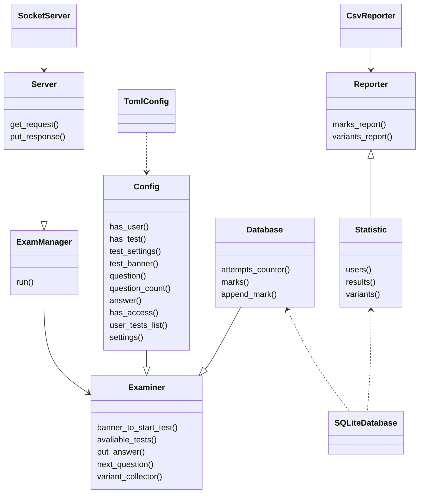

# Программа тестирования в терминале "Кот учёный"

## Технические подробности
### Описание работы клиента
Клиент отправляет короткие запросы и получает ответы от сервера. Осуществляет
две основные функции:
* Получение информации о доступных тестах (при запуске без аргументов или с ключем -l).
* Запуск и прохождение теста (при запуске с именем теста в качестве параметра).

При запросе на сервер клиент указывает учетные данные пользователя, чтобы
получить список тестов, доступных данному пользователю.
При запуске теста сначала выводится описание теста и предложение к началу
тестирования. В случае согласия пользователя загружается первый вопрос.
Тест считается запущенным с момента ввода согласия на начало тестирования.

Клиент отправляет ответы на вопрос серверу, а сервер присылает следующий вопрос.
Ответами на вопросы является одно или несколько чисел - номеров правильных ответов,
либо слово или строка текста для ответа на открытый вопрос. Числа указываются через пробел без знаков препинания.

После ответа на последний вопрос сервер присылает результат или сообщение о
завершении теста, если публикация результатов отключена в настройках.
При преждевременном завершении теста можно продолжить тестирование с последнего
отвеченного вопроса, для этого необходимо заново запустить тест.
При досрочном прерывании тестирования время не останавливается. В случае если
тест ограничен по времени, после окончания времени пользователь НЕ может ответить
на последний вопрос, загруженный до окончания времени, все оставшиеся вопросы
считаются неотвеченными и баллы за них не начисляются, сервер сохраняет результат
тестирования.

### Описание работы сервера
При запуске сервера с параметром `run` или `-r` выполняются следующие действия:
1. Считывание настроек из файла `/opt/learned-cat/settings.toml`.
2. Парсинг тестов, указанных в настройках из markdown файлов и расположенных в каталоге `/opt/learned-cat/tests/` (или другом, указанном в настройках).
3. Чтение базы данных, по умолчанию `/opt/learned-cat/marks.db`.
4. Запуск цикла обработки запросов, в этот момент выводится сообщение о номере прослушиваемого порта.

При запуске сервера с параметром `export-resuls` или `-o`:
Осуществляется экспорт результатов тестирования из каталога /opt/learned-cat/results в виде csv таблицы в формате:
`имя теста, имя пользователя, время начала теста, время завершения тестирования, результат`

В рамках взаимодействия с клиентами сервер осуществляет:
1. Проверку доступа пользователя. Пользователь может получить информацию только
о доступных ему тестах и запускать только доступные ему тесты.
2. Выдачу описания теста.
3. Генерацию варианта с учетом настроек теста.
4. Регистрацию времени начала и времени окончания тестирования.
5. Подведение итогов, проверку тестирования.
6. Завершение тестирования при окончании времени.
7. Занесение оценки за тест в базу данных.
Протокол обмена данных пользователя и клиента [описан в исходном коде](src/network/mod.rs) и осуществляется в бинарном формате по протоколу TCP.

Результаты тестирования хранятся в SQLite базе данных и содержат оценку и время тестирования.

### Архитектура сервера

